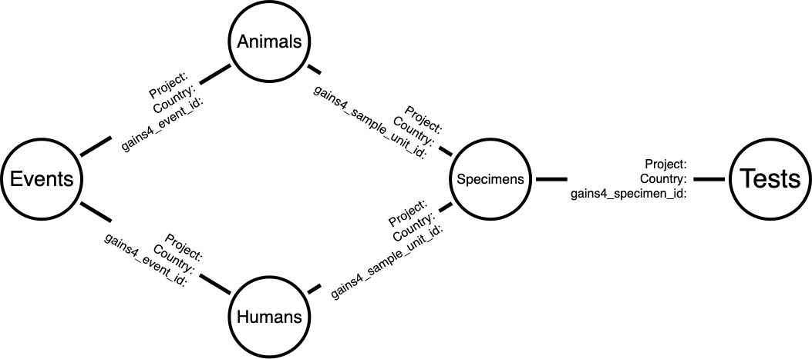

⚠️ ***This package has been deprecated. following the end of the PREDICT project in September 2020.  EIDITH Data is now accessible via the USAID Development Data Library at <https://data.usaid.gov/Global-Health-Security-in-Development-GHSD-/PREDICT-Emerging-Pandemic-Threats-Project/tqea-hwmr>*** ⚠️

With the shutdown of the EIDITH database and export to the DDL, this package can be used to process data from static backups. 

---

<!-- README.md is generated from README.Rmd. Please edit that file -->

# The EIDITH R Package

The **eidith** R package provides programmatic access and analytical
tools for data from the PREDICT program.

The **eidith** package contains no data. To access data via this package, you must be a
member of the PREDICT project.

### Package Installation

You can install the package with `remotes::install_github("ecohealthalliance/eidith")`.

### Database download

Before downloading the database, run `googledrive::drive_auth(email = "yourname@ecohealthalliance.org")` and follow the prompts. If you are working on the server or running into any issues, try `googledrive::drive_auth(email = "yourname@ecohealthalliance.org", use_oob=TRUE)`. If you are still running into issues, reach out to Emma. 

Once your Google auth is set up, download the database with `import_local_db(database = "eha")`. If you have Malaysia or global PREDICT access, you can enter 
`"eha_with_malaysia"` or `"global"` for the `database` argument. 

### Reading in tables
 
As in earlier versions of this package, once your database is downloaded, you can use the `ed2_x()` functions to read in tables. Note these tables contain Predict 2 and Predict 1 data when available. Predict 1 data are no longer in separate tables. 

The following functions are available:

`ed2_animals()`,
`ed2_behavior()`,
`ed2_crop_production()`,
`ed2_dwellings()`,
`ed2_events()`,
`ed2_extractive_industry()`,
`ed2_human()`,
`ed2_human_animal_production()`,
`ed2_human_animal_production_ehp()`,
`ed2_human_crop_production()`,
`ed2_human_ehp()`,
`ed2_human_extractive_industry()`,
`ed2_human_hospital_worker()`,
`ed2_human_hunter()`,
`ed2_human_hunter_ehp()`,
`ed2_human_market()`,
`ed2_human_restaurant()`,
`ed2_human_sick_person()`,
`ed2_human_temporary_settlements()`,
`ed2_human_zoo()`,
`ed2_market_value_chain()`,
`ed2_natural_areas()`,
`ed2_specimens()`,
`ed2_test_interpreted()`,
`ed2_test_serology()`,
`ed2_tests()`,
`ed2_training()`,
`ed2_wildlife_restaurant()`

### Basic database structure

The database is primarily represented by the above structure, with modules branching off these main nodes.

The following are fields for joining among these tables:

_events_ `project`, `country`, `gains4_event_id` 

_animals_ `project`, `country`, `gains4_event_id`, `gains4_sample_unit_id`

_humans_  `project`, `country`, `gains4_event_id`, `gains4_sample_unit_id` 

_specimens_ `project`, `country`, `gains4_sample_unit_id`, `gains4_specimen_id` 

_tests_ `project`, `country`, `gains4_specimen_id`, `gains4_test_id` 

### Data processing support functions

To unnest multi-response fields, see `?ed2_expand_long` and `?ed2_expand_wide`.

### Metadata
Somewhat outdated, but `ed2_metadata()` contains tables, fields, and descriptions.

Use `eha_countries()` and `predict_countries()` to see list of country names

### Note on deprecated functions 

`ed_db_download()` and `ed2_get()`, which previously accessed the EIDITH API, are now disabled.

